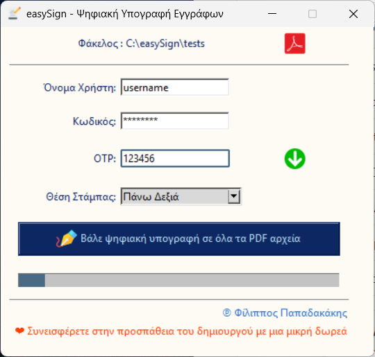

## easySign

Εφαρμογή για την εύκολή και γρήγορη ψηφιακή υπογραφή εγγράφων.

Προς το παρόν υποστηρίζεται μόνο η απομακρυσμένη υπηρεσία υπογραφής εγγράφων [Websign του ΚΣΗΔΕ](https://webapp.mindigital-shde.gr).

Η εφαρμογή αποτελείται από δύο μέρη: 

### Παράθυρο γραφικών (GUI)
Μια εφαρμογή γραφικού περιβάλλοντος (GUI Application) που δέχεται ως όρισμα τη διαδρομή ενός αρχείου ή ενός φακέλου με σκοπό την ψηφιακή υπογραφή του αρχείου ή όλων των pdf εγγράφων του φακέλου. 



Εάν πρόκειται για φάκελο, δίνεται η δυνατότητα επιλέγοντας το εικονίδιο  να μετατραπούν όλα τα έγγραφα (.doc, .docx, .rtf, .odt) που βρίσκονται στο φάκελο και στους υποφακέλους του, στη μορφή PDF, με το ίδιο όνομα και κατάληξη .pdf, ώστε στη συνέχεια να μπορεί να πραγματοποιηθεί μαζικά η υπογραφή τους.

Απαραίτητη προϋπόθεση για να λειτουργήσει η μετατροπή των αρχείων είναι η ύπαρξη εγκατάστασης στον υπολογιστή του χρήστη του [LibreOffice](https://www.libreoffice.org/download).

Στο πεδίο *Όνομα Χρήστη* εισάγεται το όνομα του χρήστη στην απομακρυσμένη υπηρεσία ψηφιακής υπογραφής.

Στο πεδίο *Κωδικός* εισάγεται ο κωδικός πρόσβασης στην απομακρυσμένη  υπηρεσία ψηφιακής υπογραφής.

Μετά από μια επιτυχημένη ψηφιακή υπογραφή εγγράφου η εφαρμογή θα σας ζητήσει να αποθηκεύσει στον υπολογιστή σας τα διαπιστευτήρια (Όνομα Χρήστη και Κωδικό) για μελλοντική χρήση. Η αποθήκευση αυτή πραγματοποιείται με ασφάλεια στην υπηρεσία αποθήκευσης διαπιστευτηρίων του Λειτουργικού Σύστηματος και τα διαπιστευτήρια αυτά δεν κοινοποιούνται πουθενά αλλού.

Στο πεδίο *OTP* εισάγεται ο κωδικός πρόσβασης μιας χρήσης (One Time Password). 

Εφόσον έχετε ενεργοποιήσει τη λήψη του OTP μέσω εφαρμογής στο κινητό σας (Google Authenticator), απλά πληκτρολογείτε το OTP στο συγκεκριμένο πεδίο. 

Στην περίπτωση που έχετε επιλέξει να λαμβάνετε το OTP μέσω ηλεκτρονικού ταχυδρομείου, επιλέγοντας το εικονίδιο  η απομακρυσμένη υπηρεσία ψηφιακής υπογραφής θα σας αποστείλει μέσω ηλεκτρονικού ταχυδρομείου το OTP το οποίο και στη συνέχει θα εισάγετε στο συγκεκριμένο πεδίο.

Στο πεδίο *Θέση Στάμπας* επιλέγεται η θέση στην οποία θα τοποθετηθεί η στάμπα της ψηφιακής υπογραφής πάνω στην πρώτη σελίδα του εγγράφου. Οι διαθέσιμες επιλογές είναι έξι (συνδυασμός πάνω-κάτω και αριστερά-κέντρο-δεξιά)και δεν προσφέρονται περεταίρω δυνατότητες για την τοποθέτηση της στάμπας καθώς ζητούμενο της εφαρμογής είναι η γρήγορη ψηφιακή υπογραφή των εγγράφων.

Επιλέγοντας το πλήκτρο *Βάλε ψηφιακή υπογραφή στο αρχείο/α* η εφαρμογή:

Εφόσον πρόκειται για μεμονωμένο αρχείο: εάν είναι έγγραφο σε μορφή .doc, .docx, .rtf, .odt η εφαρμογή μετατρέπει αρχικά το έγγραφο σε μορφή PDF και στη συνέχεια επικοινωνεί με την απομακρυσμένη υπηρεσία ψηφιακής υπογραφής για την ψηφιακή υπογραφή του PDF εγγράφου. Το ψηφιακά υπογεγραμμένο αρχείο έχει το όνομα του αρχικού αρχείου με την κατάληξη *_signed.pdf*

Εφόσον πρόκειται για φάκελο: η εφαρμογή επικοινωνεί με την απομακρυσμένη υπηρεσία ψηφιακής υπογραφής για την ψηφιακή υπογραφή όλων των PDF εγγράφων που βρίσκονται στο φάκελο και τους υποφακέλους του. Συνήθως η απομακρυσμένη υπηρεσία ψηφιακής υπογραφής θέτει όριο στο πλήθος των αρχείων που υπογράφονται μαζικά (π.χ. 50 για το ΚΣΗΔΕ). Τα ψηφιακά υπογεγραμμένα αρχεία έχουν το ίδιο όνομα με τα αρχικά αρχεία με την προσθήκη της κατάληξης *_signed.pdf*

Τέλος, παρατίθεται σύνδεσμος για αναφορά προς τον δημιουργό της εφαρμογής και το αποθετήριο του στο Github.

Επίσης, εφόσον κρίνετε ότι η εφαρμογή αυτή είναι χρήσιμη, σας αρέσει και προτίθεστε να τη χρησιμοποιήσετε, δίδεται σύνδεσμός που επιλέγοντας τον μπορείτε και εσείς να συνεισφέρετε, να ενθαρρύνετε το δημιουργό να συνεχίσει την προσπάθεια του, δωρίζοντας του ένα μικρό συμβολικό ποσό χρημάτων 3ων, 5 ή 10 Ευρώ ([θα ήθελα να συνεισφέρω τώρα](https://www.paypal.com/donate/?hosted_button_id=N6WSLKAEFZCH8)).

Αξίζει να επισημανθεί ότι η εφαρμογή αυτή μπορεί να συνδεθεί και να εκκινείτε με το δεξί κλικ του ποντικού σε γραφικό περιβάλλον εργασίας. Η δυνατότητα αυτή είναι ενσωματωμένη στο πρόγραμμα εγκατάστασης των Windows που παρέχεται στη συνέχεια.

### Γραμμή εντολών (CLI)
Μια εντολή της γραμμής εντολών (CLI) που δέχεται ένα JSON αρχείο ως όρισμα. 

Στο JSON αρχείο περιέχονται τα διαπιστευτήρια, (username, password, otp),  η διαδρομή αρχείου για τα προς υπογραφή έγγραφα και η θέση της στάμπας. 

Για παράδειγμα:
```
{
    "username": "user",
    "password": "pass",
    "otp": "123456",
    "files": ["C:\\docs\\test1.pdf", "C:\\docs\\test2.pdf"],
    "stamp_position": 3
}
```
Η δυνατότητα αυτή παρέχεται για την περίπτωση που θέλετε να συνδέσετε την εφαρμογή αυτή με κάποια άλλη δικής σας εφαρμογή για την ψηφιακή εφαρμογή εγγράφων.


### Ιnstaller
Προσφέρεται ένα έτοιμο αρχείο εγκατάστασης για τα Windows.

Μπορείτε να το λάβετε από [εδώ](https://github.com/FilipposPapad/easySign/releases/download/v0.9.0-beta.2/easySignSetup.exe).
